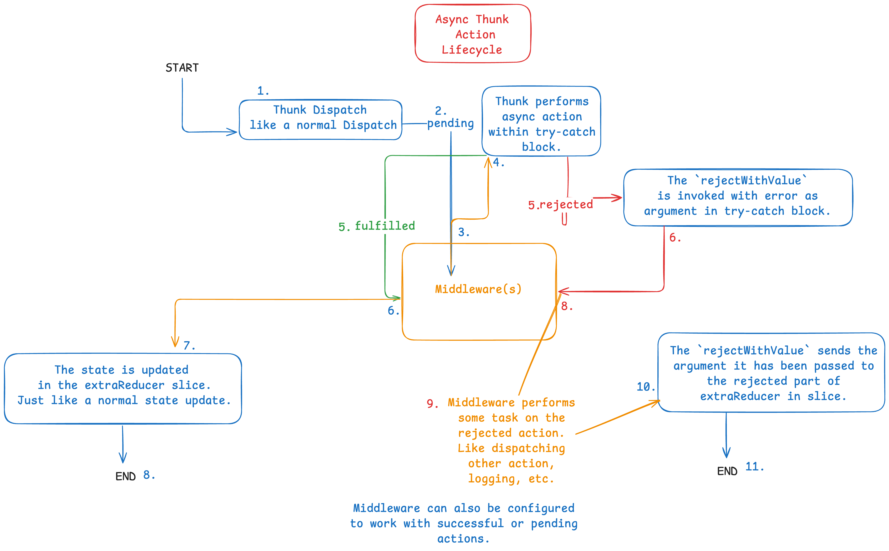

# Poké-Inventory: A Pokémon Inventory Application

## Table of Contents

- [Introduction](#introduction)
- [Tech Stack](#tech-stack)
- [Features](#features)
- [Installation (Development)](#installation-development)
- [Installation (Production)](#installation-production)
- [Project Structure](#project-structure)
- [Reflections](#reflections)
- [Conclusion](#conclusion)

## Introduction

This is a mock inventory application where you can perform CRUD (Create, Read, Update, Delete) operations on pokémon and trainers, featuring a REST API built with NodeJS and Express.js, and a PostgreSQL database with Prisma ORM. The frontend is built with React and Redux Toolkit, utilizing shadcn/ui components for styling.
To read about my experience from working on this project, please head to the section on [Reflections](#reflections).

[Live Preview](https://inventory-application-delta.vercel.app/)  
**If you want to perform a delete operation, please do so by creating a new trainer/pokémon and deleting that.**

## Tech Stack
 - React
 - Redux-Toolkit
 - shadcn/ui
 - react-select
 - Tailwind CSS
 - NodeJS
 - Express.js
 - PostgreSQL
 - Prisma ORM
 - TypeScript
 - npm workspaces

## Features

- Centralized client-side error handling, loading, state, and notification management using Redux custom middlewares and async thunks
- Centralized server-side error handling using Express middleware
- Perform CRUD operations on pokémon and trainers
- Monorepo setup with npm workspaces
- Shared types package for exporting Prisma generated types, and other types required across server & client
- Theme toggle for dark/light/system mode managed via redux state
- Client-side routing using `react-router` v7
- shadcn/ui components
- react-select for multi-select component
- Responsive design
- Skeleton loading
  
## Installation (Development)

1. Clone the repository and move into the cloned folder:
    ```bash
    git clone https://github.com/blue0206/inventory-application.git
    cd inventory-application
    ```
2. Install dependencies:
    ```bash
    npm install
    ```
3. Generate prisma client:
    ```bash
    npm run generate
    ```
4. Build the shared and backend packages to compile types:
    ```bash
    npm run build:t && npm run build:s
    ```
5. Start the development servers:
   - Frontend: 
        ```bash
        npm run dev -w frontend
        ```
   - Backend:
        ```bash
        npm run dev -w backend
        ```

## Installation (Production)

1. Clone the repository and move into the cloned folder:
    ```bash
    git clone https://github.com/blue0206/inventory-application.git
    cd inventory-application
    ```
2. Install dependencies:
    ```bash
    npm install
    ```
3. Generate prisma client:
    ```bash
    npm run generate
    ```
4. Build the packages to compile types:
    ```bash
    npm run build:t
    ```
5. To Start the production server:
    1. Backend:
        - Build the backend package to compile types and start the server with single command:
            ```bash
            npm run start
            ```
    2. Frontend:
        - Build the frontend package with Vite bundler:
            ```bash
            npm run build:c
            ```
        - Preview the production build locally:
            ```bash
            npm run preview -w frontend
            ```

## Project Structure

```
inventory-application/
├── backend/        
│   ├── src/
│   │   ├── controllers/   # Controllers for trainer and pokemon containing business logic
│   │   ├── db/            # Prisma client instance setup
│   │   ├── middlewares/   # Middleware for request verification
│   │   ├── routes/        # Routes for trainer and pokemon endpoints
│   │   ├── utils/         # Utility methods
│   │   ├── app.ts         # Express application
│   │   └── index.ts       # Entry point
│   └── prisma/            # Prisma schema and migrations
│
├── frontend/
│   ├── src/
│   │   ├── app/           # Redux Store, Typed Hooks, Middlewares, and Type Guards
│   │   ├── assets/        # Fallback images
│   │   ├── components/    # React components
│   │   ├── features/      # Redux features and their slices, standalone thunks
│   │   ├── hooks/         # Custom hooks
│   │   ├── types/         # TypeScript type definitions
│   │   ├── utils/         # Api Client, Navigation wrapper and other utility modules
│   │   ├── lib/           # shadcn config
│   │   ├── index.css      # CSS styles
│   │   ├── App.tsx        # Main application component
│   │   └── main.tsx       # Application entry point
│   │   └── routes.ts      # Routes configuration
│   └── index.html         # HTML template
│
├── shared/        
│   └── src/
│       ├── types/         # API types
│       ├── utils/         # API Error and API Response classes
│       └── index.ts       # Types exported from shared package
│
└── package.json           # npm workspaces configuration
```

## Reflections

This was my first full-stack project and I learned a whole lot from it. I made a major decision of shifting
to ui components library and TailwindCSS from vanilla CSS. I feel that at some point we all have to move
on from vanilla CSS and explore what the dev community has to offer and explore tools actually used in production.

I will share the problems I faced and how I tackled them one by one:

### Issue 1: Initial Setup

The first and foremost issue here was how to go about making a full-stack web app. I explored and found
two major ways to go about this:

1. Create two separate repositories, one for frontend and another for backend.
2. Use monorepo approach, where both frontend and backend are part of the same repository.

There was also the handling of shared types between client and server to consider—types generated by prisma and types that were to be custom-defined. For a completely type-safe application, this was a very important factor to consider. I researched a lot before deciding on the best way forward.
Here are some of the options I found:

1. Creating a types package and publishing it and use in frontend and backend. This was an ideal approach in multi-repo setup.
2. I found out about stuff like tRPC, OpenAPI, GraphQL etc., but I decided against them since I didn't need any of those features and now wasn't the time to delve into these topics.
3. Creating a shared types package in monorepo alongside the frontend and backend packages. This was intuitive but I felt uncomfortable with the idea of having to import a type from outside the bounds of the frontend/backend.

While exploring the third option, I came across npm workspaces which allowed me to create a shared types package inside the root directory of the monorepo and then importing it wherever needed. This was exactly what I wanted!

In the end I narrowed my options down to either of the following approaches:
1. Using monorepo with npm workspaces
2. Using a types package published separately and use in multi-repo

I was excited about both of them, but decided to go with the monorepo approach this time and leave multi-repo for a future project.
I quickly set up the monorepo structure and created three packages: `frontend`, `backend`, and `shared`.

### Issue 2: TypeScript Configuration

This was probably the most challenging phase. Took me a while to figure out how to configure TS compiler correctly.
The way I had set things up initially kept throwing errors related to imports. 

I had to delve into TS docs and learn more about module resolution and module options and how they affect compile and
imports. The difference between the different options like `node16`, `nodenext`, `node`, `es2022`, `commonjs`, etc.

The cause of the issue? When I checked the compiled code in shared package, it was all in CommonJS format instead of ESM and hence the imports weren't getting resolved properly in backend which was set up in ESM.

Ultimately, the solution was to sync the `compilerOptions` for backend and shared packages which seemed to fix everything. The pre-configured settings for frontend worked fine without any changes.

### Issue 3: Creating query types from Prisma namespace

This took a while to wrap my head around. I found out that Prisma only generates types for models and not queries. It 
exports a namespace called `Prisma` which can be used to generate types for queries by simply somewhat mimic-ing the
syntax of the query itself. This project didn't require any complex queries so I didn't face much issues once I found
out about the namespace.

### Issue 4: Centralizing error handling in frontend akin to backend

In my previous project, Shopping Cart, I used Redux Toolkit for the first time, but only for state management. I didn't
use any custom middlewares or async thunks, and I didn't initially intend to use them in this project.

I am, however, a big fan of how we can handle errors in express in one single place after throwing it anywhere in the entire application. Therefore, when I started with frontend, this was one of the things I really wanted to implement.

Therefore, I researched for ways to handle this and couldn't find much. There were Error boundaries but they only
handled UI errors, not API errors.  
Then I wondered if I could use Redux for error handling. After reading a lot of StackOverflow answers, I realized I
could use async thunks and middlewares for this purpose and for MUCH more. As a result, I decided to learn them for this project.

### Issue 5: Understanding Redux custom middlewares and thunks

I learned the whole thing from RTK docs, they cover everything and in a friendly, easy-to-understand manner. I would recommend anyone who wants to learn Redux to start with RTK docs.
I took some help from AI to understand some concepts I couldn't wrap my head around.

As I tried to understand the whole thing, I was confident more and more that this is exactly what I was looking for.
I even made an excalidraw doodle when I was learning (shared below).

Here's a brief summary of what I learned about async thunk actions and how middlewares are involved:

Note: This excalidraw doodle was from when I was learning things. By the end of this project, a lot of my understanding was cleared about it. Now, I believe I have a perfect mental model of how the entire thing works. Some things in the image might be a bit wrong or unclear or incomplete, that's because of the gaps in my knowledge I had back then.

### Issue 6: Strongly type Redux middlewares

The next task was to define middlewares and strongly type them. Unfortunately, this wasn't covered explicitly in the
docs. I had to research a lot and even StackOverflow didn't have much to go on this topic. I tried AI, but it gave false
positive results.
Ultimately, I decided to muster up the courage to ask in Redux community discord and got a great answer from the folks there. I'm usually scared of doing these things, I always worry if my question is too stupid. But those folks nicely
pointed me in the right direction, and even solved issues with my code which I didn't even notice.

I got introduced to matching utilities (a very important tool which came in handy when I was actually designing the
logic for middlewares) and the `Middleware` type export by RTK.

I didn't perfectly type the middleware but typed them enough to keep it within acceptable limits. It was something like this:
```typescript
const errorHandlingMiddleware: Middleware = (store) => (next) => (action) => {
    // Error handling logic
}
```

### Issue 7: Programmatically navigate a user from redux middlewares

In order to redirect users from middlewares while error handling, I needed something like `useNavigate()` hook from react-router. I looked up and there was a solution involving `createBrowserHistory`, but this was deprecated back in v5 or v6, and I was using v7. So I had to look for something else.
Ultimately, the solution I came across was to create a wrapper function around `useNavigate()`'s instance and use it in the entire application for routing.

[You can check the implementation here.](./frontend/src/utils/navigation.ts)

### Issue 8: Deployment

This was the scariest part of the bunch. My app saw over 90 failed/faulty deployments and I was worried that my half-a-month of effort would go to waste.
I spent the last few days trying to figure out why it was failing.

I was doubting myself whether I had setup npm workspaces correctly. As a result, I ended up trying out alternative like
Turborepo to handle my monorepo but even that didn't fix the issue.

In some cases, the build was successful but when previewed, the screen was blank and the console showed errors about resolving prisma from shared package. 
Based on this error, I found out on Prisma GitHub issues that this was probably because of the use of enums.
As a result, I removed the Pokemon Type enum from my schema and exported a custom defined enum from shared package instead.
Not very elegant approach but the situation was dire. I even had to migrate my db because of this but the issue was still
not fixed.

After a lot of trials, I finally figured out that the issue was because I was exporting prisma client and namespace from
my shared package, and because of this, Vite was trying to bundle the prisma package as well which is not meant for browser and hence the errors.
Once I removed the prisma from the export, the deployment went through smoothly.

The prisma client was being exported from shared package to be used in backend for queries. This was intended in the beginning because I thought I'd need prisma client in shared package to generate types. However, this was not the case and I completely forgot about removing it from exports.
In the end, I only ever used Prisma namespace in shared package to generate the types only and didn't export it.
And I instantiated the prisma client in backend instead since that was the only place where it was used.
The cause of the issue was very simple, but this is how many real world scenarios are, where devs can work on debugging for hours or days, only to find out the root cause being something trivial.

## Conclusion

This project was a very valuable experience. I learned a whole lot of new things: RTK thunks, RTK middlewares, npm workspaces, monorepos, tailwindcss, component libraries, and prisma. I also learned a lot about how to debug and troubleshoot issues. If you're still here, thanks for reading, it means a lot! ❤️